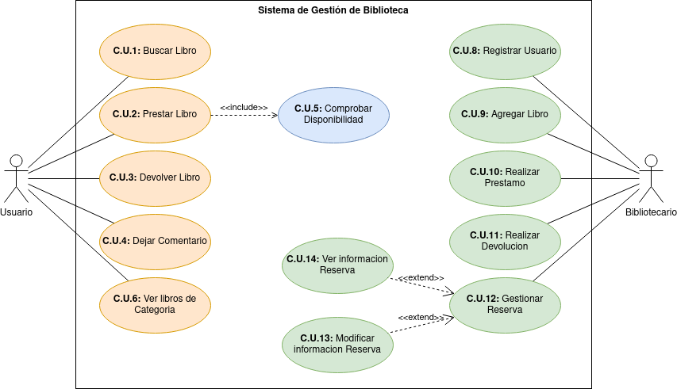

# Sistema-de-Gestion-de-Biblioteca
Sistema de Gestion de Biblioteca de Jonay Contreras 
- [x] Diagrama Casos de Uso
- [] Diagrama Clases
- [] Código
## Índice
1. [Diagrama de casos de uso](#diagrama-de-casos-de-uso)
    - [Actores](#actores)
    - [Atributos](#atributos)
    - [Casos de Uso](#casos-de-uso)
## Diagrama de Casos de Uso

### Actores

|  Actor | Usuario |
|---|---|
| Descripción  | Persona que accede al sistema |
| Características  |  |
| Relaciones |   |
| Referencias | CU1: BuscarLibro, CU2: Prestar Libro, CU3 Devolver Libro, CU4 Dejar Comentario, CU6 Ver libros de Categoria, CU5 Comprobar Disponibildiad |   
|  Notas |   |
| Autor  | JonayKB |
|Fecha | 20/12/2023 |

|  Actor | Bibliotecario |
|---|---|
| Descripción  | Persona gestiona partes del sistema |
| Características  |  |
| Relaciones |   |
| Referencias | CU8: Registrar Usuario, CU9: Agregar Libro, CU10 Realizar Prestamo, CU11 Realizar Devolucion, CU12 Gestionar Reserva, CU13 Ver Informacion Reserva, CU14 Modificar informacion Reserva |   
|  Notas |   |
| Autor  | JonayKB |
|Fecha | 20/12/2023 |

### Atributos

#### Usuario
|  Atributos |||
|---|---|---|
| Nombre  | Nombre del usuario  | String |
| Identificador  | Numero Unico diferenciador  | int |
| Prestamos  | Historial de Prestamos del Usuario  | List\<Prestamo> |
| | |
#### Bibliotecario
|  Atributos |||
|---|---|---|
| Nombre  | Nombre del usuario  | String |
| Identificador  | Numero Unico diferenciador  | int |
| Horario  | Horario laboral del trabajador  | String |
| | |

### Casos de Uso

  |  Caso de Uso	CU1 | Buscar Libro  |
  |---|---|
  | Fuentes  | [Proyecto](https://github.com/jpexposito/docencia/blob/master/Primero/ETS/PROYECTO/README.md)  |
  | Actor  |  Usuario |
  | Descripción | Buscar un libro dependiendo del Autor/Categoría/Titulo  |
  | Flujo básico | 1-Buscar Libro |
  | Pre-condiciones |   |  
  | Post-condiciones  |   |  
  |  Requerimientos |   |
  |  Notas |  |
  | Autor  | JonayKB |
  |Fecha | 20/12/2023 |

  |  Caso de Uso	CU2 | Prestar Libro  |
  |---|---|
  | Fuentes  | [Proyecto](https://github.com/jpexposito/docencia/blob/master/Primero/ETS/PROYECTO/README.md)  |
  | Actor  |  Usuario |
  | Descripción | Crear un prestamo al usuario  |
  | Flujo básico | 1-Prestar Libro |
  | Pre-condiciones | CU5 Comprobar Disponibilidad  |  
  | Post-condiciones  |   |  
  |  Requerimientos |   |
  |  Notas |  |
  | Autor  | JonayKB |
  |Fecha | 20/12/2023 |

  |  Caso de Uso	CU3 | Devolver Libro  |
  |---|---|
  | Fuentes  | [Proyecto](https://github.com/jpexposito/docencia/blob/master/Primero/ETS/PROYECTO/README.md)  |
  | Actor  |  Usuario |
  | Descripción | Devolver un libro  |
  | Flujo básico | 1-Devolver Libro |
  | Pre-condiciones |   |  
  | Post-condiciones  |   |  
  |  Requerimientos |   |
  |  Notas |  |
  | Autor  | JonayKB |
  |Fecha | 20/12/2023 |

  |  Caso de Uso	CU4 | Dejar Comentario  |
  |---|---|
  | Fuentes  | [Proyecto](https://github.com/jpexposito/docencia/blob/master/Primero/ETS/PROYECTO/README.md)  |
  | Actor  |  Usuario |
  | Descripción | Dejar un comentario a un libro  |
  | Flujo básico | 1-Dejar cometario a Libro |
  | Pre-condiciones |   |  
  | Post-condiciones  |   |  
  |  Requerimientos |   |
  |  Notas |  |
  | Autor  | JonayKB |
  |Fecha | 20/12/2023 |

  |  Caso de Uso	CU5 | Comprobar Disponibilidad  |
  |---|---|
  | Fuentes  | [Proyecto](https://github.com/jpexposito/docencia/blob/master/Primero/ETS/PROYECTO/README.md)  |
  | Actor  |  Usuario |
  | Descripción | Comprueba si un libro esta disponible  |
  | Flujo básico | 1-Comprobar Disponibilidad |
  | Pre-condiciones |   |  
  | Post-condiciones  |   |  
  |  Requerimientos |   |
  |  Notas |  |
  | Autor  | JonayKB |
  |Fecha | 20/12/2023 |

  |  Caso de Uso	CU6 | Ver Libros de Categoria  |
  |---|---|
  | Fuentes  | [Proyecto](https://github.com/jpexposito/docencia/blob/master/Primero/ETS/PROYECTO/README.md)  |
  | Actor  |  Usuario |
  | Descripción | Ver todos los libros referentes a una categoria  |
  | Flujo básico | 1-Ver Libros |
  | Pre-condiciones |   |  
  | Post-condiciones  |   |  
  |  Requerimientos |   |
  |  Notas |  |
  | Autor  | JonayKB |
  |Fecha | 20/12/2023 |

  |  Caso de Uso	CU8 | Registar Usuario  |
  |---|---|
  | Fuentes  | [Proyecto](https://github.com/jpexposito/docencia/blob/master/Primero/ETS/PROYECTO/README.md)  |
  | Actor  |  Bibliotecario |
  | Descripción | Registra un usuario en el sistema  |
  | Flujo básico | 1-Registrar Usuario |
  | Pre-condiciones |   |  
  | Post-condiciones  |   |  
  |  Requerimientos |   |
  |  Notas |  |
  | Autor  | JonayKB |
  |Fecha | 20/12/2023 |

  |  Caso de Uso	CU9 | Agregar Libro  |
  |---|---|
  | Fuentes  | [Proyecto](https://github.com/jpexposito/docencia/blob/master/Primero/ETS/PROYECTO/README.md)  |
  | Actor  |  Bibliotecario |
  | Descripción | Agrega un Libro al sistema  |
  | Flujo básico | 1-Agregar Libro |
  | Pre-condiciones |   |  
  | Post-condiciones  |   |  
  |  Requerimientos |   |
  |  Notas |  |
  | Autor  | JonayKB |
  |Fecha | 20/12/2023 |

  |  Caso de Uso	CU10 | Realizar Prestamo  |
  |---|---|
  | Fuentes  | [Proyecto](https://github.com/jpexposito/docencia/blob/master/Primero/ETS/PROYECTO/README.md)  |
  | Actor  |  Bibliotecario |
  | Descripción | Realiza un prestamo a un usuario y libro  |
  | Flujo básico | 1-Realizar Prestamo |
  | Pre-condiciones |   |  
  | Post-condiciones  |   |  
  |  Requerimientos |   |
  |  Notas |  |
  | Autor  | JonayKB |
  |Fecha | 20/12/2023 |

  |  Caso de Uso	CU11 | Realizar Devolucion  |
  |---|---|
  | Fuentes  | [Proyecto](https://github.com/jpexposito/docencia/blob/master/Primero/ETS/PROYECTO/README.md)  |
  | Actor  |  Bibliotecario |
  | Descripción | Comprueba que un usuario ha devuelto un libro  |
  | Flujo básico | 1-Realizar Devolucion |
  | Pre-condiciones |   |  
  | Post-condiciones  |   |  
  |  Requerimientos |   |
  |  Notas |  |
  | Autor  | _JonayKB |
  |Fecha | 20/12/2023 |

  |  Caso de Uso	CU12 | Gestionar Reserva  |
  |---|---|
  | Fuentes  | [Proyecto](https://github.com/jpexposito/docencia/blob/master/Primero/ETS/PROYECTO/README.md)  |
  | Actor  |  Bibliotecario |
  | Descripción | Elegir entre ver o modificar  |
  | Flujo básico | 1-Gestionar Reserva |
  | Pre-condiciones |   |  
  | Post-condiciones  |   |  
  |  Requerimientos |   |
  |  Notas |  |
  | Autor  | _JonayKB |
  |Fecha | 20/12/2023 |

  |  Caso de Uso	CU13 | Ver informacion Reserva  |
  |---|---|
  | Fuentes  | [Proyecto](https://github.com/jpexposito/docencia/blob/master/Primero/ETS/PROYECTO/README.md)  |
  | Actor  |  Bibliotecario |
  | Descripción | Ver la informacion de una reserva  |
  | Flujo básico | 1-Ver informacion |
  | Pre-condiciones | Gestionar Reserva  |  
  | Post-condiciones  |   |  
  |  Requerimientos |   |
  |  Notas |  |
  | Autor  | _JonayKB |
  |Fecha | 20/12/2023 |

  |  Caso de Uso	CU14 | Modificar informacion Reserva  |
  |---|---|
  | Fuentes  | [Proyecto](https://github.com/jpexposito/docencia/blob/master/Primero/ETS/PROYECTO/README.md)  |
  | Actor  |  Bibliotecario |
  | Descripción | Modificar la informacion de una reserva  |
  | Flujo básico | 1-Modificar informacion |
  | Pre-condiciones | Gestionar Reserva  |  
  | Post-condiciones  |   |  
  |  Requerimientos |   |
  |  Notas |  |
  | Autor  | _JonayKB |
  |Fecha | 20/12/2023 |
## Diagrama de Clases

